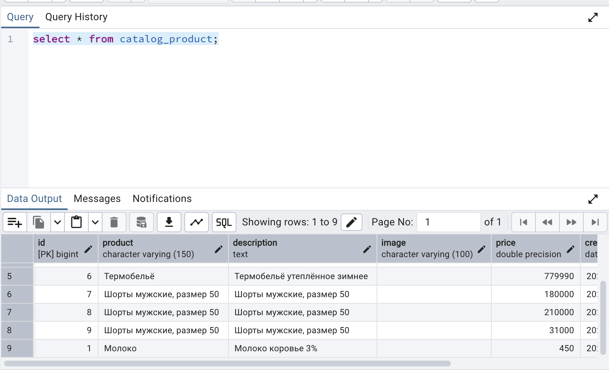

# 23 Работа с ORM в Django

## Описание проекта
Проект представляет собой протопит интернет-магазина. На данном этапе реализации сделано:

* К проекту подключена СУБД PostgreSQL
* Создана база данных catalog
* В БД созданы две таблицы: category (Категории) и product (Продукты - Товары). Таблица category связана через внешний 
  ключ с таблицей product по схеме "один ко многим".
* Для переноса моделей таблиц из Django в PostgreSQL применены миграции.
* Проверена работа инструмента Django Shell:
  * Создать несколько категорий продуктов:
  
  
  * Получить все категории:
  
  * Получить все продукты:
  
  * Найти все продукты в определенной категории:
  
  * Обновить цену для определенного продукта:
  
  
  * Удалить продукт:
  
  
  
  
* Сформированы фикстуры для моделей Category и Product.
* Создана кастомная команда для добавления тестовых продуктов. При этом перед добавлением новых продуктов 
  существующие записи в БД удаляются.

* В качестве дополнения:
  * Добавлен в контроллер отображения на главной странице выборки последних 5 созданных 
    продуктов и выведите их в консоль.
  * Создайте модель для хранения контактных данных и выведите данные, заполненные через админку, на страницу с контактами.
  
